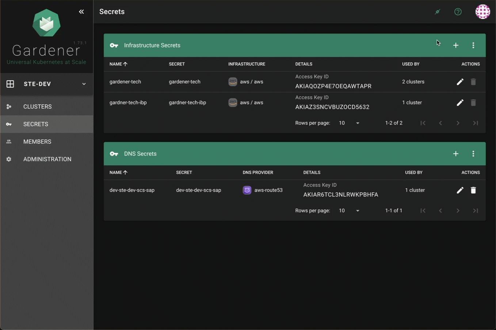

# Deployment Steps

Follow these steps to deploy your Kubernetes cluster and associated components:

### **Clone the following repo**
Clone Repo: https://gitlab.core.sapns2.us/scs/s4pce/kubernetes
This repo will be used as a base template; throughout this documentation files such as "env-config.yaml" for example will be referred to for configuration. When these references are made please refer to the template file provided and do not create it from scratch.

### **Create Gardener IAM User in AWS Account**:
Use the policy provided in the Gardener project documentation to create an IAM user in your AWS account. This user will have the permissions necessary for Gardener to manage resources in AWS.
<details>
<summary><b>Required Policy for Gardener IAM User</b></summary>

```json
{
"Version": "2012-10-17",
"Statement": [
    {
    "Effect": "Allow",
    "Action": "autoscaling:*",
    "Resource": "*"
    },
    {
    "Effect": "Allow",
    "Action": "ec2:*",
    "Resource": "*"
    },
    {
    "Effect": "Allow",
    "Action": "elasticloadbalancing:*",
    "Resource": "*"
    },
    {
    "Action": [
        "iam:GetInstanceProfile",
        "iam:GetPolicy",
        "iam:GetPolicyVersion",
        "iam:GetRole",
        "iam:GetRolePolicy",
        "iam:ListPolicyVersions",
        "iam:ListRolePolicies",
        "iam:ListAttachedRolePolicies",
        "iam:ListInstanceProfilesForRole",
        "iam:CreateInstanceProfile",
        "iam:CreatePolicy",
        "iam:CreatePolicyVersion",
        "iam:CreateRole",
        "iam:CreateServiceLinkedRole",
        "iam:AddRoleToInstanceProfile",
        "iam:AttachRolePolicy",
        "iam:DetachRolePolicy",
        "iam:RemoveRoleFromInstanceProfile",
        "iam:DeletePolicy",
        "iam:DeletePolicyVersion",
        "iam:DeleteRole",
        "iam:DeleteRolePolicy",
        "iam:DeleteInstanceProfile",
        "iam:PutRolePolicy",
        "iam:PassRole",
        "iam:UpdateAssumeRolePolicy"
    ],
    "Effect": "Allow",
    "Resource": "*"
    }
]
}
```
</details> 
<br>

### **Create Infra Secret in Gardener Project**:
Use the IAM credentials generated in the previous step to create an infrastructure secret in your Gardener project. This secret allows Gardener to provision and manage the underlying AWS resources for your Kubernetes cluster.
<details>
<summary><b>Creating Gardener Infra Secret</b></summary>

{width=75%}

</details>
<br>

### **Create DNS Secret**:
Utilize the IAM credentials for the hosted zone (obtained from the prerequisites list) to create a DNS secret. This secret is necessary for managing DNS records through Gardener.
<details>
<summary><b>Creating Gardener DNS Secret</b></summary>

{width=75%}

</details>
<br>

### **Update Technical User in Gardener Project and Download kubeconfig**:
In the members section of your Gardener project, update the technical user to have both admin and service admin permissions. After updating, download the `kubeconfig` configuration file (this will need to be pushed to gitlab later). For automation scripts, rename this file to `kuberobot.yaml`.
<details>
<summary><b>Gardener Technical User Update and kubeconfig Download</b></summary>

{width=75%}

</details>
<br>

### **Create Repo Tech User in Gitlab**:
In the GitLab project, create a new user or access tokens with the role of `Maintainer` with `api`, `read_api`, `read_repository`, and `write_repository` permissions. This user will be used for deploying applications and managing the GitLab repository.
<details>
<summary><b>Creating Tech User Access Token in GitLab</b></summary>

{width=75%}

</details>
<br>

### **Add global secrets to vault for argocd and pgsql**:
#### **Vault Secrets Structure**
##### Note: pgsql is only required for SFTPGO, ETD does not require a PostgreSQL database for example
The deployment requires specific secrets to be stored in Vault. These secrets are organized under the `global` base path and are divided into two main sections: `argocd` for Argo CD configurations and `pgsql` for PostgreSQL database configurations.

<details>
<summary><b>Global Vault Path Structure and Detail</b></summary>

#### Vault Path Structure:

```txt
global
├── argocd
│ ├── ARGOCD_ADMIN
│ ├── ARGOCD_ADMIN_PASS
│ ├── REPO_TECH_PAT
│ └── REPO_TECH_USER
└── pgsql
  ├── HOST
  ├── PASSWORD
  ├── PORT
  └── USERNAME
```

#### Vault Secret Examples

ste/dev/gardener/global/argocd:
```
{
  "ARGOCD_ADMIN": "admin",
  "ARGOCD_ADMIN_PASS": "QwerRewq123",
  "REPO_TECH_PAT": "<Token>",
  "REPO_TECH_USER": "<TokenUser>"
}
```

ste/dev/gardener/global/pgsql:
```
{
  "HOST": "sftpdb.zzzzzz.us-gov-west-1.rds.amazonaws.com",
  "PASSWORD": "QwerRewq123",
  "PORT": "5432",
  "USERNAME": "postgres"
}
```

ste/dev/gardener/global/aws:
```
{
  "credentials": "[default]\naws_access_key_id=XXX\naws_secret_access_key=XXX\nregion=us-gov-west-1"
}
```

ste/dev/gardener/global/vault:
```
{
  "ROLE_ID": "xxxxxxxx-xxxx-xxxx-xxxx-xxxxxxxxxxxx",
  "SECRET_ID": "xxxxxxxx-xxxx-xxxx-xxxx-xxxxxxxxxxxx",
  "VAULT_ADDR": "https://vault.my.vault.us"
}
```
#### Vault Password Details:
| Section | Secret Name         | Description                                | Notes                                                                                |
| ------- | ------------------- | ------------------------------------------ | ------------------------------------------------------------------------------------ |
| argocd  | `ARGOCD_ADMIN`      | User defined Argo CD admin username        | Example value: `admin`                                                               |
| argocd  | `ARGOCD_ADMIN_PASS` | User defined Argo CD admin password        | Recommended to generate random value. <br>Example command: `openssl rand -base64 16` |
| argocd  | `REPO_TECH_PAT`     | Repository technical personal access token | Generated in previous step.                                                          |
| argocd  | `REPO_TECH_USER`    | User defined Repository technical user     | Example value: `REPO_TECH_USER`                                                      |
| pgsql   | `HOST`              | PostgreSQL database host                   | Default host endpoint generated when RDS instance is created via terraform.          |
| pgsql   | `PASSWORD`          | PostgreSQL database password               | Default admin password generated when RDS instance is created via terraform.         |
| pgsql   | `PORT`              | PostgreSQL database port                   | Default port for PostgreSQL is `5432`.                                               |
| pgsql   | `USERNAME`          | PostgreSQL database username               | Default admin username generated when RDS instance is created via terraform.         |
</details>

#### Ensure all the required secrets are correctly set in Vault under the specified paths before proceeding with the deployment.
<br>

### **Add `kuberobot.yaml` to GitLab Secure Files**:
In the GitLab project created for this deployment, navigate to `Settings > CI/CD > Secure Files` and add the downloaded `kuberobot.yaml` file. This file is crucial for CI/CD pipelines to interact with your Kubernetes cluster.
<details>
<summary><b>Creating Tech User Access Token in GitLab</b></summary>

{width=75%}

</details>
<br>

### **Add Vault Variables in GitLab Project**:
Still within the GitLab project, go to the `CI/CD` settings and then to the `Variables` section. Add the following variables: `vault_role_id` and `vault_secret_id`. It is recommended to mark these variables as "Protected" and "Masked". These values are part of the Vault AppRole authentication information generated during the Vault Path AppRole token request in the dependencies section.

<details>
<summary><b>Uploading secure file in GitLab</b></summary>

{width=75%}

</details>
<br>

### **Update `env-config.yaml`**:
Locate the `env-config.yaml` file in [`scripts/config/env-config.yaml`](../scripts/configs/env-config.yaml) and update it with the information provided in the template file. This configuration file contains environment-specific settings for your deployment.

### **Update `values-overlay-template.yaml`**:
Locate the `values-overlay-template.yaml` file in [`charts/cluster/shoot/values-overlay-template.yaml`](../charts/cluster/shoot/values-overlay-template.yaml) and update it with your provisioned dedicated Shoot VPC. 

<details>
<summary><b>Example of </b></summary>

VPC CIDR:
```
10.60.0.0/16
```
NOTE:
Nodes must align with the VPC, utilizing the VPC's subnets, route tables, and other networking components.

Pods operate within an overlay or abstracted network managed by Kubernetes but are still fundamentally part of the VPC's network.

Services provide network endpoints and load balancing for pods within the same Kubernetes-managed network overlay but are also accessible within the VPC context.pods to other pods, services, or external users. They provide networking and load balancing.


shoot charts/cluster/shoot/values-overlay-template.yaml snippet example:
```
...
provider:
  aws:
    networks:
      nodes: 10.60.0.0/16
      pods: 100.96.0.0/11
      services: 100.64.0.0/13
    zonenet:
      - workers: 10.60.0.0/19
        public: 10.60.96.0/22
        internal: 10.60.112.0/22
      - workers: 10.60.128.0/19
        public: 10.60.160.0/20
        internal: 10.60.176.0/20
      - workers: 10.60.192.0/19
        internal: 10.60.224.0/20
        public: 10.60.240.0/20
...
```
</details> 
<br>

### **Enable Runners**
Step 1: Log in to GitLab
Open your web browser and go to your GitLab instance.
Log in with your credentials.

Step 2: Access Project Settings
Navigate to the project where you want to enable runners.
In the left sidebar, click on Settings.
From the dropdown, select CI / CD.

Step 3: Enable Shared Runners
Scroll down to the Runners section.
You will see an option for Shared runners. If this is not enabled, you can enable it by toggling the switch. Shared runners are runners that are available to all projects within the GitLab instance.

### **Trigger Deployment via GitLab CI/CD**:
Commit the updated `env-config.yaml` to your repository. This action will trigger the GitLab CI/CD pipeline, which deploys your Kubernetes cluster, Argo CD, system components, and application components.

### **Verify Shoot Deploy**

<details>
<summary><b>Uploading secure file in GitLab</b></summary>

Login to gardener and verify your shoot is deployed 


{width=75%}

</details>
<br>


### **Verify Argo**

<details>
<summary><b>Uploading secure file in GitLab</b></summary>

Login to https://argocd.<hostedzone>/applications


{width=75%}

</details>
<br>


### Prerequisites and Deployment Step Relationships:

<details>
<summary><b>Relationship Graph</b></summary>


</details>

### By following these steps, you will have deployed your Kubernetes cluster and all necessary components. For information on how to access the new cluster and system services, refer to the [tips and tricks](tips-and-tricks.md) documentation.

